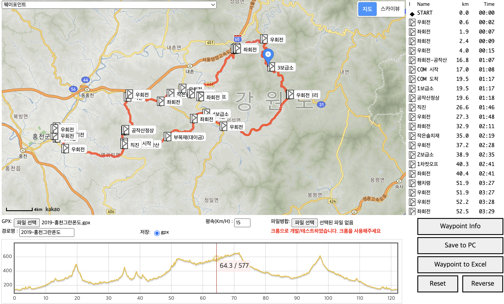

## [http://giljabi.kr](http://giljabi.kr/)
### [https://giljabi.tistory.com/](https://giljabi.tistory.com/)
### [https://gpxtcx.tistory.com/](https://gpxtcx.tistory.com//)

## openrouteservice, google elevation api
* 경로탐색을 위한 api, 구글 고도정보를 가져오는 api 사용하는 방법을 공유합니다
  나중에는 경로탐색도 구글을 사용하게 변경할 예정입니다.


## 소스 공유
### Tistory : [giljabi.tistory.com](https://giljabi.tistory.com/) 소스 공유
### github : [https://github.com/parknamjun/giljabi](https://github.com/parknamjun/giljabi)
* 사용법 http://localhost:8080/giljabi.html
* Frontend 부분은 제일 아렵습니다. 그래서 UI가 매우 과거형입니다. 
  원래 사용목적이 경로만 만드는것이라 기본에는 충실하고자 하였습니다.
* 다음 버전은 경로를 직접 그리고 다음지도에서 제공하지 않는 높이정보을 구글지도 API에서 가져와서 gpx 파일을 만드는 방법을 
  하려고 합니다.
  

## [gpxtcx.tistory.com](https://gpxtcx.tistory.com/) 다양한 경로 공유


* [openrouteservice.org](https://openrouteservice.org/)
* [openrouteservice-docs](https://github.com/GIScience/openrouteservice-docs)
* [google elevation api](https://developers.google.com/maps/documentation/elevation/start)

API 테스트 방법
1. 경로탐색
.http 파일의 내용을 참고
```
GET http://localhost:8080/api/1.0/route?start=127.01117,37.5555&target=126.99448,37.54565&direction=cycling-road
Content-Type: application/json
```   

2. 높이정보 
```
POST http://localhost:8090/api/1.0/elevation
Content-Type: application/json

{
"trackPoint":[
{"lng":127.03178,"lat":37.59244},
{"lng":127.03221,"lat":37.59245},
{"lat":37.59234,"lng":127.03322},
{"lat":37.59161,"lng":127.03348},
{"lat":37.59173,"lng":127.03391},
{"lat":37.59197,"lng":127.03438},
{"lat":37.59217,"lng":127.03472},
{"lat":37.59242,"lng":127.03514},
{"lat":37.59236,"lng":127.03522},
{"lat":37.59247,"lng":127.03557},
{"lat":37.59247,"lng":127.0361},
{"lat":37.59245,"lng":127.03618},
{"lat":37.59241,"lng":127.03635},
{"lat":37.59197,"lng":127.03634}
]
}
```
